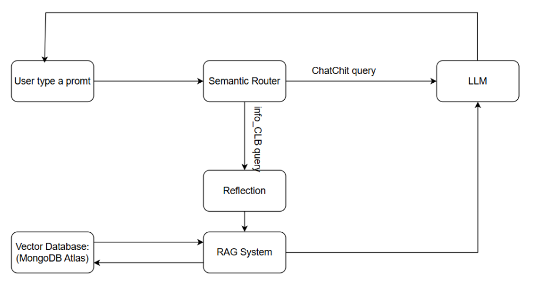

# 🚀 NeoRAG Cup 2025

## Giới thiệu
**RAG** - Chatbot RAG trả lời về CLB Lập Trình PTIT. Kiến trúc dùng semantic router, reflection, dense retrieval, cross-encoder reranker.
**Tên kiến trúc:** RAG-Dense + Router + Reflection + Cross-Encoder Rerank

**Tóm tắt:** User -> Semantic Router - > Reflection(rewrite) - > Dense retrieval (MongoDB + vectorSearch) -> Cross-encoder Reranker -> chọn top k -> LLM sinh câu trả lời.

**Sơ đồ kiến trúc:**

---

##  Luồng chi tiết
**Router(semantic_router):** 
+ Chọn route ``info_CLB`` hay ``chitchat``
+ Route ``info_CLB``: rewrite câu hỏi bằng **Reflection**, encode câu hỏi bằng ``text-embedding-3-large``, truy vấn bằng vectorSearch trong MongoDB, **rerank** bằng cross-encoder, ghép context rồi gọi gpt-4o-mini trả lời.
+ Route ``chitchat``: trả lời tự nhiên, không dùng context CLB.

---

## Các thành phần chính
#### 1. Dense retrieval (Vector Search)
- Truy xuất tài liệu bằng embedding: biến query thành vector rồi tìm k văn bản tương đồng nhất theo độ tương đồng (cosin).
#### 2. Semantic routing
- Bộ định tuyến phân loại ý định để quyết định có dùng RAG hay không (ở đây: ``info_CLB`` và ``chitchat``)
- Điểm mạnh: Điều tiết đúng luồng giúp trả lời nhanh gọn
- Điểm yếu: Nếu mẫu chưa đại diện thì có thể định tuyến sai
#### 3. Rerank (Cross-Encoder)
- Mô hình cross-encoder chấm điểm cặp (query, passage) để xếp hạng lại N ứng viên từ retrieval.
#### 4. Reflection (Query Rewrite)
- Viết lại truy vấn dựa vào lịch sử hội thoại để làm rõ ngữ cảnh, giúp embedding phù hợp hơn -> retrieval chuẩn hơn.

---

## 📊 Benchmark

### **Retrieval – Train (100 query)** 
| K   | hit@k | recall@k | precision@k | f1@k  | map@k | mrr@k | ndcg@k | context_precision@k | context_recall@k | context_entities_recall@k |
| --- | ----- | -------- | ----------- | ----- | ----- | ----- | ------ | ------------------- | ---------------- | ------------------------- |
| 3   | 0.68  | 0.544    | 0.2         | 0.261 | 0.402 | 0.403 | 0.428  | 0.593               | 0.50             | 0.32                      |
| 5   | 0.63  | 0.602    | 0.172       | 0.257 | 0.434 | 0.443 | 0.499  | 0.578               | 0.442            | 0.364                     |
| 7   | 0.7   | 0.559    | 0.14        | 0.224 | 0.439 | 0.451 | 0.514  | 0.539               | 0.414            | 0.385                     |

### **LLM Answer – Train (100 query)**
| K   | string_presence@k | rouge_l@k | bleu_4@k | groundedness@k | response_relevancy@k | noise_sensitivity@k |
| --- | ----------------- | --------- | -------- | -------------- | -------------------- | ------------------- |
| 3   | 0.366             | 0.22      | 0.032    | 0.57           | 0.807                | 0.502               |
| 5   | 0.389             | 0.224     | 0.036    | 0.62           | 0.803                | 0.52                |
| 7   | 0.41              | 0.22      | 0.035    | 0.62           | 0.81                 | 0.521               |

---

### **Retrieval – Test (30 query)**
| K   | hit@k | recall@k | precision@k | f1@k  | map@k | mrr@k | ndcg@k | context_precision@k | context_recall@k | context_entities_recall@k |
| --- | ----- | -------- | ----------- | ----- | ----- | ----- | ------ | ------------------- | ---------------- | ------------------------- |
| 3   | 0.87  | 0.648    | 0.4         | 0.528 | 0.761 | 0.783 | 0.787  | 0.34                | 0.32             | 0.11                      |
| 5   | 0.8   | 0.637    | 0.4         | 0.427 | 0.771 | 0.807 | 0.824  | 0.35                | 0.29             | 0.15                      |
| 7   | 0.83  | 0.678    | 0.224       | 0.354 | 0.765 | 0.807 | 0.24   | 0.31                | 0.27             | 0.16                      |

### **LLM Answer – Test (30 query)**
| K   | string_presence@k | rouge_l@k | bleu_4@k | groundedness@k | response_relevancy@k | noise_sensitivity@k |
| --- | ----------------- | --------- | -------- | -------------- | -------------------- | ------------------- |
| 3   | 0.18              | 0.14      | 0.01     | 0.33           | 0.79                 | 0.68                |
| 5   | 0.16              | 0.15      | 0.01     | 0.30           | 0.79                 | 0.71                |
| 7   | 0.21              | 0.15      | 0.02     | 0.39           | 0.80                 | 0.71                |

---

### Giải thích các metrics

**hit@k**  
- **Ý nghĩa:** Tỷ lệ truy vấn mà kết quả đúng xuất hiện trong top-k kết quả trả về.  
- **Phản ánh:** Giá trị cao nghĩa là mô hình thường tìm được câu trả lời đúng trong top-k; giá trị thấp nghĩa là mô hình bỏ sót nhiều. Ưu điểm: dễ hiểu; nhược điểm: không xét vị trí chính xác trong top-k.

**recall@k**  
- **Ý nghĩa:** Tỷ lệ các câu trả lời đúng được tìm thấy trong top-k trên tổng số câu trả lời đúng.  
- **Phản ánh:** Cao → tìm được nhiều câu trả lời đúng; thấp → bỏ sót nhiều. Ưu điểm: đánh giá độ bao phủ; nhược điểm: không phản ánh độ chính xác.

**precision@k**  
- **Ý nghĩa:** Tỷ lệ câu trả lời đúng trong top-k kết quả.  
- **Phản ánh:** Cao → ít kết quả sai; thấp → nhiều kết quả nhiễu. Ưu điểm: đo độ chính xác; nhược điểm: không phản ánh số lượng câu trả lời tìm được.

**f1@k**  
- **Ý nghĩa:** Trung bình điều hòa của precision@k và recall@k.  
- **Phản ánh:** Cao → cân bằng tốt giữa độ chính xác và độ bao phủ; thấp → mất cân bằng. Ưu điểm: cân bằng hai yếu tố; nhược điểm: khó diễn giải nếu một chỉ số quá thấp.

**map@k (Mean Average Precision)**  
- **Ý nghĩa:** Trung bình của độ chính xác tại mỗi vị trí có kết quả đúng trong top-k.  
- **Phản ánh:** Cao → mô hình trả kết quả đúng ở vị trí cao; thấp → kết quả đúng nằm sâu. Ưu điểm: xét thứ tự kết quả; nhược điểm: tính toán phức tạp.

**mrr@k (Mean Reciprocal Rank)**  
- **Ý nghĩa:** Trung bình nghịch đảo của vị trí câu trả lời đúng đầu tiên trong top-k.  
- **Phản ánh:** Cao → câu trả lời đúng thường xuất hiện sớm; thấp → xuất hiện muộn. Ưu điểm: tập trung vào câu trả lời đúng đầu tiên; nhược điểm: bỏ qua các câu trả lời đúng khác.

**ndcg@k (Normalized Discounted Cumulative Gain)**  
- **Ý nghĩa:** Đo lường độ liên quan của kết quả, có xét vị trí trong top-k.  
- **Phản ánh:** Cao → kết quả liên quan ở vị trí cao; thấp → kết quả liên quan nằm sâu. Ưu điểm: phản ánh tốt thứ hạng; nhược điểm: cần thông tin độ liên quan.

**context_precision**  
- **Ý nghĩa:** Tỷ lệ thông tin ngữ cảnh được truy xuất là chính xác.  
- **Phản ánh:** Cao → ít thông tin dư thừa; thấp → nhiều nhiễu. Ưu điểm: đo độ sạch dữ liệu ngữ cảnh; nhược điểm: không xét độ đầy đủ.

**context_recall**  
- **Ý nghĩa:** Tỷ lệ thông tin ngữ cảnh đúng được lấy ra so với tổng số thông tin đúng.  
- **Phản ánh:** Cao → lấy được nhiều thông tin quan trọng; thấp → bỏ sót nhiều. Ưu điểm: đo độ bao phủ ngữ cảnh; nhược điểm: không phản ánh độ chính xác.

**context_entities_recall@k**  
- **Ý nghĩa:** Tỷ lệ thực thể (entities) đúng xuất hiện trong ngữ cảnh top-k.  
- **Phản ánh:** Cao → hầu hết thực thể cần thiết xuất hiện; thấp → nhiều thực thể bị thiếu. Ưu điểm: phù hợp cho bài toán yêu cầu thông tin thực thể; nhược điểm: phụ thuộc vào chất lượng nhận diện thực thể.

**string_presence@k**  
- **Ý nghĩa:** Tỷ lệ câu trả lời chứa đúng chuỗi ký tự kỳ vọng trong top-k.  
- **Phản ánh:** Cao → câu trả lời khớp trực tiếp với đáp án mong muốn; thấp → ít khớp. Ưu điểm: đơn giản; nhược điểm: không xét ý nghĩa tương đồng.

**rouge_l@k**  
- **Ý nghĩa:** Độ trùng khớp theo chuỗi con chung dài nhất (Longest Common Subsequence) giữa câu trả lời và đáp án.  
- **Phản ánh:** Cao → câu trả lời gần giống đáp án; thấp → ít trùng khớp. Ưu điểm: đánh giá tốt độ bao phủ; nhược điểm: không xét thứ tự chính xác toàn phần.

**bleu_4@k**  
- **Ý nghĩa:** Độ trùng khớp n-gram (4-gram) giữa câu trả lời và đáp án.  
- **Phản ánh:** Cao → câu trả lời sát ngữ cảnh đáp án; thấp → khác biệt lớn. Ưu điểm: phổ biến trong NLP; nhược điểm: nhạy với thay đổi nhỏ về từ ngữ.

**groundedness@k**  
- **Ý nghĩa:** Mức độ câu trả lời dựa trên thông tin đã truy xuất.  
- **Phản ánh:** Cao → ít thông tin bịa; thấp → nhiều thông tin ngoài ngữ cảnh. Ưu điểm: đánh giá tính tin cậy; nhược điểm: khó đo tự động chính xác.

**response_relevancy**  
- **Ý nghĩa:** Mức độ liên quan của câu trả lời với câu hỏi.  
- **Phản ánh:** Cao → câu trả lời phù hợp; thấp → lạc đề. Ưu điểm: phản ánh trải nghiệm người dùng; nhược điểm: cần đánh giá thủ công hoặc mô hình phụ.

**noise_sensitivity@k**  
- **Ý nghĩa:** Mức độ mô hình bị ảnh hưởng bởi dữ liệu nhiễu trong top-k.  
- **Phản ánh:** Cao → dễ bị nhiễu tác động; thấp → mô hình ổn định hơn. Ưu điểm: giúp kiểm tra khả năng chống nhiễu; nhược điểm: khó tính toán nếu không có dữ liệu nhiễu rõ ràng.

